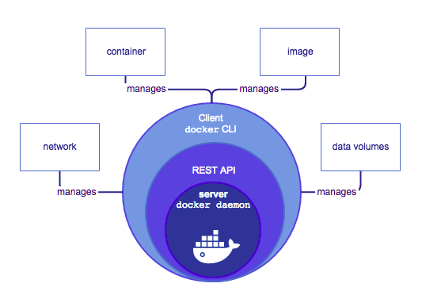

Table of content
+ [Docker overview](#docker-overview)
+ [The Docker platform](#the-docker-platform)
+ [Docker Engine](#docker-engine)
+ [Docker architecture](#docker-architecture)
    + [Docker daemon](#docker-daemon)
    + [Docker client](#docker-client)
    + [Docker objects](#docker-objects)
        + [Images](#images)
        + [Container](#container)


# Docker

## Docker overview

Docker là open platform cho phát triển, shipping và chạy các ứng dụng. Docker cho phép bạn tách biệt ứng dựng với kiến trúc hạ tầng vì vậy bạn có thể vận chuyển ứng dụng một cách nhanh chóng. Với Docker, bạn có thể quản lý cơ sở hạ tầng cùng với cách quản lý ứng dụng. Docker mang lại những lợi ích cho shipping, testing và triển khai code nhanh chóng, giảm đáng kể thời gian trễ giữa việc viết code và triển khai nó trong sản phẩm.
### The Docker platform

Docker cung cấp khả năng đóng gói và chạy ứng dựng trong một môi trường tách biệt được gọi là container. Sự tách biệt và an toàn cho phép bạn chạy nhiều container đồng thời trên một host có sẵn. Container nhẹ vì không cần extra load như một hypervisor, nhưng chạy trực tiếp trong host machine's kernel. Bạn có thể chạy nhiều containers với phần cứng kết hợp có sẵn nếu bạn sử dụng virtual machines. Bạn có thể chạy Docker container trên các virtual machine.

Docker cung cấp công cụ và nền tảng để quản lý lifecycle container của bạn:
- Phát triển ứng dụng và các thành phần hỗ trợ sử dụng container
- Container trở thành đơn vị cho phân phối và test ứng dụng 
- Triển khai ứng dụng trên môi trường sản xuất như một container hoặc một dịch vụ orchestrated. Công việc xảy ra như nhau dù môi trường sản phẩm là local data center, cloud provider hay hyperid. 
### Docker Engine

Docker Engine là một ứng dụng client-server với các thành phần chủ yếu: 
- Server một chương trình long-running được gọi daemon process (dockerd command)
- REST API chỉ định giao diện mà chương trình sử dụng để nói với daemon và hướng dẫn nó phải làm gì 
- Command line interface (CLI) client


CLI sử dụng Docker REST API để control và tương tác với Docker daemon thông qua scripting hoặc trực tiếp từ CLI command. Daemon tạo và quản lý các Docker object như images, containers, networks và volumes.

### Docker architecture 

Docker sử dụng kiến trúc client-server. Docker client nói với Docker daemon thực hiện building, running và phân phối Docker container của bạn. Docker client và daemon có thể chạy trên cùng hệ thống hoặc bạn kết nối Docker client tới một Docker remote Docker daemon. Docker client và daemon giao tiếp sử dụng REST API, qua các UNIX socket hoặc network interface.


#### Docker daemon

Docker daemon (dockerd) lắng nghe Docker API request và quản lý đối tượng Docker như image, container, network và volume. Một Daemon cũng có thể giao tiếp với nhiều daemon khác để quản lý Docker service.

#### Docker client

Docker client (docker) là cách chính để nhiều người dùng Docker tương tác với Docker. Khi bạn sử dụng lệnh như ```docker run```, client gửi các lệnh tới ```dockerd```, ```docker``` sử dụng Docker API và có thể giao tiếp với nhiều daemon.

#### Docker objects
##### Images
Một *image* là một mẫu chỉ đọc với các lệnh để tạo Docker container. Thường, một image dựa trên image khác và thêm các tuỳ chỉnh. Ta có thể tự tạo image hoặc dùng image đã được tạo sẵn public trong registry. Để build image riêng, tạo Dockerfile định nghĩa các bước để tạo image và chạy nó. Mỗi lệnh trong Dockerfile tạo một lớp trong image. Khi bạn thay đổi Dockerfile và rebuild image, chỉ các lớp thay đổi mới được build lại. Một trong những lí do làm cho image lightweight, small và fast khi so sánh với các công nghệ khác.
##### Container
Một container là môt runnable instance của image. Ta có thể create, start, stop, move hoặc delete một container sử dụng Docker API hoặc CLI. Bạn có thể kết nối một container tới một hoặc nhiều mạng, gắn storage hoặc tạo image mới dựa trên trạng thái hiện tại.

Mặc định, một container tương đối tách biệt với các container khác và host machine. Bạn có thể điều khiển làm thế nào tách biệt container network, storage hoặc các hệ thống cơ bản từ các container khác hoặc từ host machine.

Một container được xác định bởi image cũng như mọi tuỳ chọn cấu hình bạn cung cấp cho nó khi bạn tạo hoặc start nó. Khi một container được gỡ, mọi thay đổi trạng thái của nó không được lưu trữ.
##### Docker Volume
Volume là kỹ thuật ưu tiên để duy trì dữ liệu được tạo và sử dụng bởi Docker container. Trong khi bind mount phụ thuộc vào cấu trúc thư mục của host machine, volume được quản lý hoàn toàn bởi Docker. Volume có các lợi ích hơn so với bind mount:
+ Volume dễ dàng hơn để back up hoặc migrate so với bind mounts
+ Ta có thể quản lý volume sử dụng Docker CLI command hoặc Docker API 
+ Volume làm việc trên cả Linux và Window container
+ Volume an toàn hơn khi chia sẻ dữ liệu giữa các container 
+ Volume driver cho phép bạn lưu trữ volume trên remote host hoặc cloud provider, để mã hoá nội dung của Volume hoặc thêm các chức năng khác
+ Volume mới có thể có nội dung được dựng sẵn bởi một container

Hơn nữa, volume là lựa chọn tốt hơn persisting data trong một lớp được ghi bởi container, do volume không làm tăng kích thước của container sử dụng nó.


Để sử dụng volume ta có thể dùng tuỳ chọn ```-v``` hoặc ```--volume``` cho dạng chuẩn container và ```--mount``` khi sử dụng swarm service. Tuy nhiên, từ Docker 17.06, bạn có thể sử dụng ```-0mount``` với container chuẩn. 
+ ```-v``` hoặc ```--volume```: bao gồm 3 trường, tách nhau bởi dấu hai chấm.
  + tên volume định danh trên máy chủ. Với volume ẩn danh, có thể bỏ qua
  + path của file hoặc directory được mount trong container
  + list tuỳ chọn tách nhau bởi dấu phẩy
+ ```--mount```: bao gồm các cặp giá trị tách nhau bởi dấu phẩy 
**Create và manage volume**
```
docker volume create my-vol
```

- List volume
```
docker volume ls
```
- Remove volume
```
docker volume rm my-vol
```
- Start container với một volume 
  - với mount 
```
$ docker run -d \
  --name devtest \
  --mount source=myvol2,target=/app \
  nginx:latest
```
  - với ```-v```
```
docker run -d \
  --name devtest \
  -v myvol2:/app \
  nginx:latest
```

### Dockerfile
- ```FROM``` bắt đầu Dockerfile. Nó được yêu cầu rằng Dockerfile phải bắt đầu với lệnh ```FROM```. Các Image có được tạo trong các lớp nghĩa là bạn có có thể sử dụng một image khác như base image cho image của bạn. Lệnh ```FROM``` định nghĩa lớp cơ sở của bạn. Như một tham số, nó lấy tên của image. Tuỳ chọn, bạn có thể thêm Docker Cloud username của maintainer và image version, trong định dạng ```username/imagename:version```.
- ```RUN``` được sử dung để build up một Image mà bạn tạo. Mỗi lệnh ```RUN```, Docker sẽ chạy command sau đó tạo một lớp mới của image. Cách này bạn có thể cuộn image của bạn trở lại trạng thái trước dễ dàng. Cú pháp cho lệnh RUN đặt full text của lệnh shell sau RUN (e.g. ```RUN mkdir /user/local/foo```). Việc này sẽ tự động chạy trong shell ```/bin/sh```. Bạn có thể định nghĩa một shell khác giống nó ```RUN /bin/bash -c 'mkdir /user/local/foo'```
- COPY copy local file tới container.
- ```CMD``` định nghĩa các lệnh sẽ chạy trên Image tại thời điểm bắt đầu. Không giống như RUN, điều này không tạo một tầng mới của Image chỉ đơn giản là chạy lệnh. Sẽ chỉ có một ```CMD``` trong một Dockerfile/Image. Nếu bạn muốn chạy nhiều lệnh cách tốt nhất là để CMD chạy một script. CMD yêu cầu bạn nói với nó nơi sẽ chạy lệnh, không giống như RUN. Ví dụ
```
CMD ["python", "./app.py"]

CMD ["/bin/bash", "echo", "Hello World"]
```
- ```EXPOSE``` tạo dấu cho người dùng image một cổng cung cấp service. Nó bao gồm thông tin có thể lấy lại qua ```$ docker inspect <container-id>```
+ ENV: defines enviroment variables
> ENV GIT_VERSION 1:2.1.4-2.1
+ WORKDIR: changes of directory
> WORKDIR /root
+ ENTRYPOINT: defines the command to excute when starting the container
> ENTRYPOINT ["/root/compile.sh"]

- PUSH push image của bạn lên Docker Cloud hoặc một private registry thay thế.

#### Example Dockerfile

**Example 1**

```bash
 # Use an official Python runtim as parent image
 FROM python:2.7-slim

 # Set working directory to /app
 WORKDIR /app

 # Copy the current directory contents into the container at /app
 ADD . /app

 # Install package depencies specified in requirements.txt
 RUN pip install --trusted-host pypi.python.org -r requirements.txt

 # Make port 80 available to the world outside this container
 EXPOSE 80

 # Define enviroment variable
 ENV NAME World

 # Run app.py when the container launches
 CMD ["python", "app.py"]
```
**Example 2**

- Dockerfile 

  ```
  MAINTAINER QUY
  COPY script.sh /script.sh
  CMD ["/script.sh"]
  ```

- script.sh

  ```
  #! bin/sh
  echo hello world!
  ```
#### Docker command
- ```docker run [OPTIONS] IMAGE[:TAG] [COMMAND] [ARG...]```: chạy image đã tồn tại 
  - ```-p```: chỉ định cổng
  - ```-v```: gắn một file hay ổ đĩa vào container
- ```docker images```: liệt kê các images 
- ```docker ps```: liệt kê các container đang chạy
- ```docker ps -a```: liệt kê tất cả container đã tắt 
- ```docker rm -f 
  
  ```
## Docker-compose
Docker compose cho phép chạy ứng dụng trên Docker multi-container. Sử dụng compose file để cấu hình các service cho ứng dụng. Để chạy ứng dụng chỉ cần lệnh ```docker-compose up```.
Một số command:
+ docker-compose version: kiểm tra version
+ docker-compose ps: hiện thị danh sách container
+ docker-compose build: build hoặc rebuild service
+ docker-compose config: xem file config Compose
+ docker-compose rm: gỡ bỏ ngừng container
Ví dụ về docker-compose file
```
version: '3'

services:
  product-service:
    build: ./product
    volumes: 
      - ./product:/usr/src/app
    ports:
      - 5001:80

  website:
    image: php:apache
    volumes:
      - ./website:/var/www/html
    ports:
      - 5000:80
    depends_on:
      - product-service
```
