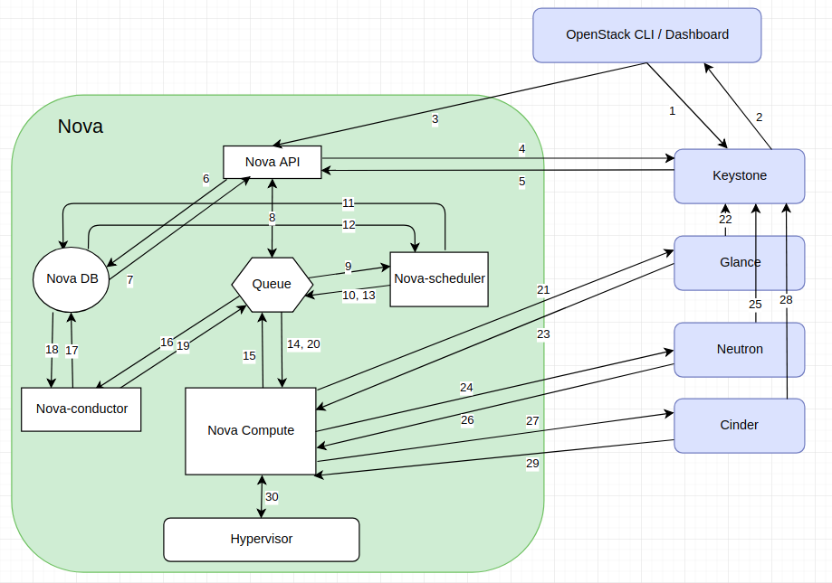

## Create Instance (Virtual Machine) in OpenStack via OpenStack CLI
```bash
# nova boot --flavor m1.small --image centos7 --nic net-id={private_network_id} --security-group norprod_sec_grp  --key-name my_key stack_testvm
```

- Step 1: OpenStack CLI lấy user credential và xác thực với identity service thông qua REST API
  - Identity service (Keystone) xác thực người dùng với user credential sau đó generate và gửi lại một auth-token cho phép sử dụng để gửi request tới các component khác thông qua REST-Call
- Step 2: OpenStack CLI chuyển đổi yêu cầu chỉ định cho instance mới tới một REST API request và gửi nó tới nova-api
- Step 3: Nova-api service nhận được request và gửi request tới identity service (Keystone) để xác thực auth-token và quyền truy cập
  - Keystone service xác nhận token và update authentication header với các role và permission
- Step 4: Sau khi nhận được phản hồi từ keystone, nova-api kiểm tra conflict với nova-database và sau đó tạo initial database entry cho new instance
- Step 5: Nova-api gửi rpc.call request tới nova-scheduler để lấy instance entry đã được update với host id được chỉ định
- Step 6: Nova-scheduler chọn request từ queue
- Step 7: Nova-scheduler nói với nova-database để định vị host thích hợp sử dụng cơ chế filtering và weighing
  - nova-scheduler trả về instance entry đã update với host ID thích hợp sau khi filtering và weighing
  - nova-scheduler gửi request rpc.cast tới nova compute để khởi chạy instance với host thích hợp
- Step 8: Nova-compute chọn request từ queue và gửi request rpc.call tới nova-conductor để lấy instance info như host id và flavor (RAM, CPU, Disk)
- Step 9: Nova-conductor lấy request từ queue và giao tiếp với nova-database
  - nova-conductor lấy thông tin instance
  - nova-compute chọn thông tin instance từ queue
- Step 10: Nova-compute kết nối tới glance-api bằng cách tạo một REST CALL sử dụng auth-token và sau đó nova-compute sử dụng image id để lấy image URI từ image service và tải image từ image storage
- Step 11: Glance-api xác nhận auth-token với keystone và sau đó nova-compute lấy image metadata
- Step 12: Nova-compute tạo REST-call thông qua auth-token tới Network API (Neutron) để định vị và cấu hình mạng để VM lấy địa chỉ IP
- Step 13: Neutron-server xác nhận auth-token với keystone và sau đó nova-compute lấy network information
- Step 14: Nova-compute tạo REST-call thông qua auth-token tới Volume API để gắn volume tới instance
- Step 15: Cinder-api xác nhận auth-token với keysone sau đó nova-compute lấy thông tin về block storage
- Step 16: Nova-compute tạo data cho hypervisor driver và thực hiện yêu cầu trên hypervisor sử dụng libvirt hoặc API, cuối cùng một VM được tạo trên hypervisor.
